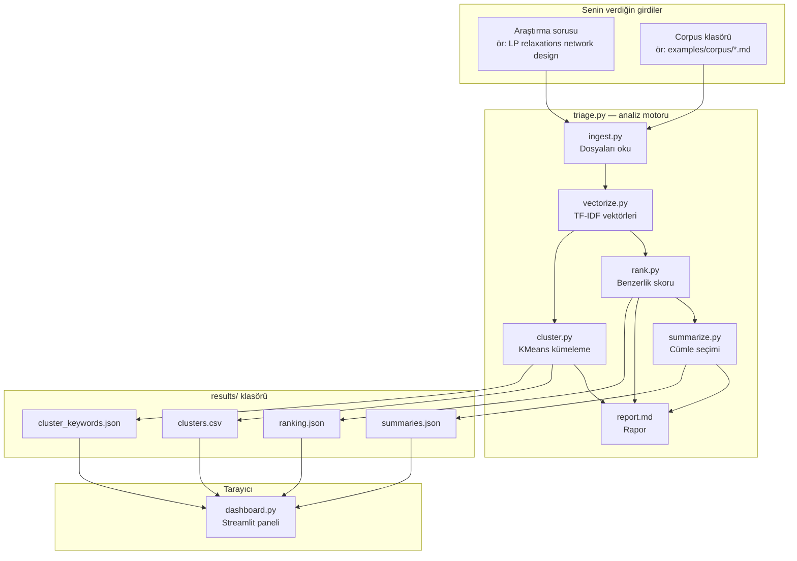
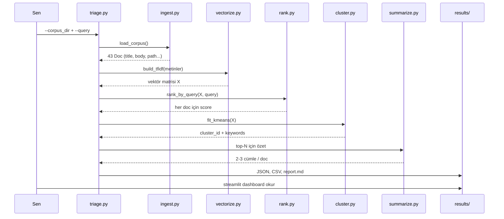
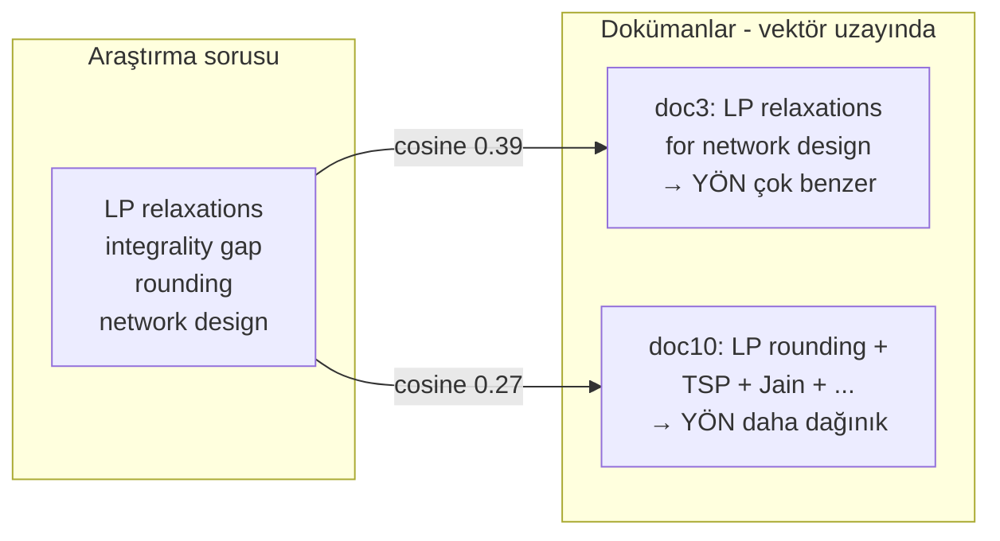

# Literature Triage Tool — Başlangıç Rehberi

Bu dosya, projeye **sıfırdan** bakan biri için hazırlanmıştır.  
Teknik terimleri mümkün olduğunca sade anlatır; akışı şemalarla gösterir.

---

## 1. Bu proje ne yapıyor?

Elinde bir sürü **makale özeti, not veya metin** var. Hepsini tek tek okumak zor.

Bu araç şunu yapar:

1. Bir **araştırma sorusu** verirsin (İngilizce veya Türkçe kelimeler olabilir; corpus İngilizce ise İngilizce soru daha iyi sonuç verir).
2. Araç, klasördeki tüm dokümanları okur.
3. Soruya **en çok benzeyenleri üstte** listeler → *“Önce bunları oku.”*
4. Benzer konuları **kümelere** ayırır → *“Konular şu temalara ayrılmış.”*
5. Her üst sıradaki doküman için **2–3 cümlelik özet** çıkarır.
6. Sonuçları **web panelinde** (Streamlit) gösterir.

> **Önemli:** Bu proje ChatGPT gibi yeni metin **yazmaz**. Sadece dokümandaki **mevcut cümleleri** seçer ve sıralar. Buna *extractive* (çıkarmalı) özet denir.

---

## 2. Büyük resim (tek bakışta)



**İki aşamalı çalışma:**

| Aşama | Komut | Ne olur? |
|-------|--------|----------|
| **1 — Analiz** | `python triage.py ...` | `results/` altına JSON/CSV/rapor yazılır |
| **2 — Görüntüleme** | `streamlit run dashboard.py` | Tarayıcıda tablolar ve özetler gösterilir |

Dashboard **yeni analiz yapmaz**; sadece `results/` dosyalarını okur.

---

## 3. Senin çalıştırdığın komutlar ne yaptı?

```bash
source .venv/bin/activate      # Python sanal ortamı
pip install -r requirements.txt
bash examples/run_example.sh   # ← asıl analiz burada
streamlit run dashboard.py     # ← sonuçları göster
```

`run_example.sh` içindeki sabit soru:

```text
2-edge-connected spanning subgraph approximation in subcubic graphs using parity correction
```

Farklı soru denemek için `run_example.sh` yerine doğrudan:

```bash
python triage.py \
  --corpus_dir examples/corpus \
  --query "LP relaxations integrality gap rounding network design" \
  --topn 10 \
  --n_clusters 4 \
  --cache \
  --out_dir results
```

---

## 4. Klasör yapısı — hangi dosya ne işe yarar?

```text
lit_triage_week1/
│
├── triage.py          ← Ana komut: tüm pipeline'ı çalıştırır
├── ingest.py          ← .txt / .md / .pdf okur, Doc listesi üretir
├── vectorize.py       ← Metinleri sayısal vektöre çevirir (TF-IDF)
├── rank.py            ← Soru ile doküman benzerliği (cosine)
├── cluster.py         ← KMeans ile konu grupları
├── summarize.py       ← Dokümandan en alakalı 2–3 cümle
├── report.py          ← İnsan okunur report.md
├── dashboard.py       ← Web arayüzü
├── utils.py           ← Yardımcı fonksiyonlar
│
├── examples/corpus/   ← Örnek dokümanlar (43 adet abstract)
├── results/           ← Analiz çıktıları (pipeline sonrası oluşur)
│   ├── ranking.json
│   ├── clusters.csv
│   ├── cluster_keywords.json
│   ├── summaries.json
│   └── report.md
│
├── README.md          ← Teknik kurulum kılavuzu
└── REHBER.md          ← Bu dosya (başlangıç rehberi)
```

---

## 5. Pipeline adım adım (detaylı)



### Adım 1 — Ingestion (`ingest.py`)

- `examples/corpus/` altındaki `.md`, `.txt` (ve varsa `.pdf`) dosyalarını tarar.
- Her dosyadan **başlık** (ilk satır) ve **gövde** ayırır.
- Çok kısa / boş dosyaları atlar.
- Skorlama için metin: `başlık + gövde` birleşimi kullanılır (başlık da skora girer).

### Adım 2 — Vectorize (`vectorize.py`)

Metinleri **sayısal vektörlere** çevirir. Yöntem: **TF-IDF**.

| Terim | Basit anlam |
|-------|-------------|
| **TF** (Term Frequency) | Kelime bu dokümanda ne kadar sık? |
| **IDF** (Inverse Document Frequency) | Kelime tüm corpus'ta ne kadar nadir? Nadir kelime → daha değerli |
| **Bigram** | İki kelimelik ifade, örn. `network design`, `lp relaxations` |

### Adım 3 — Ranking (`rank.py`)

- Araştırma sorusu da aynı TF-IDF uzayına çevrilir.
- Her doküman ile soru arasında **cosine similarity** hesaplanır → `score` (0 ile 1 arası, pratikte genelde 0.05–0.5).
- En yüksek skorlar **rank 1, 2, 3...** olur.



### Adım 4 — Clustering (`cluster.py`)

- Tüm dokümanlar **4 gruba** (varsayılan `--n_clusters 4`) ayrılır.
- Her gruba otomatik **anahtar kelimeler** atanır (`cluster_keywords.json`).
- Cluster numarası (0, 1, 2, 3) rastgele etiket; önemli olan **keywords** ve hangi makalelerin birlikte gruplandığı.

### Adım 5 — Summarization (`summarize.py`)

- Sadece **top-N** (ör. ilk 10) doküman için çalışır.
- Gövde cümlelere bölünür; soruya en benzeyen **2–3 cümle** seçilir.
- LLM yok; dokümandaki **orijinal cümleler** kullanılır.

### Adım 6 — Report + Dashboard

- `report.md`: Tablolar + okuma sırası önerisi.
- `dashboard.py`: Aynı veriyi interaktif tablo ve detay panelinde gösterir.

---

## 6. Skor (score) nasıl hesaplanır? — Sık sorulan soru

> *“1. sıradaki dokümanda daha az kelime var, neden en yüksek puan onda?”*

Çünkü skor **kelime sayısı değil**, **yönelim benzerliği**dir.

### Örnek: LP sorusu

**Soru:** `LP relaxations integrality gap rounding network design`

**1. sıra — doc3** (kısa, ~23 kelime gövde):

```markdown
# LP relaxations for network design
We summarize common LP relaxations and rounding patterns used in network design...
Includes integrality gap language...
```

Sorudaki terimlerin **hemen hepsi** bu kısa metinde → vektör soruya **paralel** → skor **yüksek** (ör. 0.39).

**2. sıra — doc10** (daha uzun):

- LP, rounding, network design geçiyor **ama**
- Ayrıca T-join, TSP, Jain, parity gibi **başka konular** da var
- Vektör “dağılır” → skor **daha düşük** (ör. 0.27)

### Benzetme

| | Doküman A (kısa) | Doküman B (uzun) |
|---|------------------|------------------|
| İçerik | %90'ı soruyla ilgili | %20'si soruyla ilgili |
| İnsan düşüncesi | “Az kelime” | “Çok kelime var” |
| Araç | **A üstte** | B altta |

Tablodaki `word_count` sadece **gövde uzunluğu** bilgisidir; **skoru etkilemez**.

### Cosine similarity (tek cümle)

İki vektörün **açısal benzerliği**: aynı yöne bakıyorlarsa skor yüksek, dik açıdaysa düşük.

---

## 7. Dashboard — ekranda ne görürsün?

```mermaid
flowchart TB
    subgraph sidebar [Sol kenar çubuğu]
        RD[Results directory = results]
        RL[Reload]
        CF[Cluster filter]
        TN[Show top-N slider]
    end

    subgraph left [Sol ana alan]
        TBL[Ranked documents tablosu<br/>rank | score | title | cluster]
        INS[Inspect document seçimi]
        CK[Cluster keywords listesi]
    end

    subgraph right [Sağ panel]
        DET[Document detail]
        SUM[Query-focused summary]
        SNIP[Snippet önizleme]
    end

    sidebar --> left
    INS --> right
```

| Bölüm | Anlamı |
|-------|--------|
| **rank** | Okuma önceliği: 1 = önce oku |
| **score** | Soruya benzerlik (yüksek = daha alakalı) |
| **cluster_id** | Hangi konu kutusunda (0–3) |
| **Cluster keywords** | O kutunun tema etiketleri |
| **Query-focused summary** | Soruya en yakın 2–3 cümle |
| **Snippet** | Dokümanın kısa önizlemesi |

**Cluster filter:** Sadece bir kümedeki makaleleri görmek için (ör. sadece “network design” teması).

**Reload:** `triage.py`'ı yeni soruyla tekrar çalıştırdıysan, dashboard'u yenilemek için.

---

## 8. `results/` dosyaları — ne içerir?

| Dosya | İçerik |
|-------|--------|
| `ranking.json` / `.csv` | Top-N liste: rank, score, title, cluster_id, path |
| `clusters.csv` | **Tüm** dokümanların cluster_id'si |
| `cluster_keywords.json` | Her cluster için anahtar kelimeler |
| `summaries.json` | Top-N için özet cümleler + snippet |
| `report.md` | Okunabilir özet rapor |
| `cache/` | `--cache` ile TF-IDF önbelleği (corpus değişmediyse hızlandırır) |

---

## 9. Kendi corpus'unu kullanmak

1. Bir klasör oluştur, örn. `my_corpus/`.
2. Her makale için bir `.md` veya `.txt` dosyası koy.
3. **İlk satır = başlık** (tercihen `# Başlık` formatında).
4. Gövde = abstract veya notların.

```bash
python triage.py \
  --corpus_dir my_corpus \
  --query "senin araştırma sorun buraya" \
  --topn 10 \
  --n_clusters 4 \
  --out_dir results
```

**İpucu:** Soruyu, corpus'taki dil ve terimlerle yaz (İngilizce makale → İngilizce soru).

---

## 10. Sık karışan noktalar (SSS)

### Dashboard'da soru değiştiremiyorum?

Normal. Soru `triage.py` çalışırken verilir. Yeni soru → terminalde `triage.py` tekrar → dashboard'da **Reload**.

### Skorlar neden hep düşük (0.1–0.4)?

TF-IDF + cosine'da bu normal. **Sıra** önemli: 0.39 > 0.27 > 0.10.

### Cluster 0, 1, 2 ne anlama geliyor?

Sabit anlam yok; her çalıştırmada etiketler değişebilir. **Cluster keywords** satırına bak: `edge connected`, `tsp`, `network design` gibi.

### ChatGPT / LLM var mı?

Hayır. Proje bilinçli olarak klasik ML (TF-IDF, KMeans) kullanır; hızlı, şeffaf, offline çalışır.

### PDF destekleniyor mu?

Evet (`pymupdf` kuruluysa). Metin çıkarımı kalitesi PDF'e göre değişir; MVP için `.md` / `.txt` daha güvenilir.

### `run_example.sh` ile manuel `triage.py` farkı?

Aynı şey; script sadece hazır parametrelerle `triage.py` çağırır.

---

## 11. Örnek senaryolar

### Senaryo A — Orijinal demo (`run_example.sh`)

```text
Soru: 2-edge-connected spanning subgraph ... parity correction
Üst sıra: Subcubic 2-edge-connected, general 2-edge-connected, lower bounds...
```

### Senaryo B — LP / network design (senin denediğin)

```text
Soru: LP relaxations integrality gap rounding network design
Üst sıra: LP relaxations for network design, LP rounding for network design...
```

### Senaryo C — Matching / TSP

```bash
python triage.py --corpus_dir examples/corpus \
  --query "Christofides matching parity correction metric TSP" \
  --topn 10 --n_clusters 4 --out_dir results
```

---

## 12. Tek paragraf özet

**Literature Triage Tool**, bir klasördeki makale/not arşivini verdiğin araştırma sorusuna göre **TF-IDF benzerliği** ile sıralar, **KMeans** ile konu gruplarına ayırır, üst sıradakiler için **mevcut cümlelerden özet** çıkarır ve sonucu **Streamlit dashboard**'da “ne okumalıyım?” listesi olarak gösterir. İki komut: önce `triage.py` (analiz), sonra `streamlit run dashboard.py` (görüntüleme).

---

## 13. Hızlı komut kartı

```bash
# Kurulum (bir kez)
cd lit_triage_week1
python -m venv .venv
source .venv/bin/activate
pip install -r requirements.txt

# Analiz
python triage.py --corpus_dir examples/corpus \
  --query "BURAYA SORUN" --topn 10 --n_clusters 4 --cache --out_dir results

# Panel
streamlit run dashboard.py
```

---

*Bu rehber proje kod tabanına (Hafta 1–8 planı tamamlandıktan sonra) göre yazılmıştır. Teknik detaylar için `README.md` dosyasına bakabilirsin.*
